# Graphics Processing Units

###### Spezielle Rechnerarchitekturen - WS' 21/22

---
<!-- _header: "
__Graphics Processing Units__
"-->

## Agenda

1. Aktuelles Marktgeschehen
2. Allgemeine Funktionsweise
3. Geschichte
4. Architektur
5. Einsatzbereiche
6. Ausblick: Raytracing

---
<!-- _header: "
__Graphics Processing Units__\n
Bild: Preisentwicklung einer Einsteiger-Grafikkarte [B1]
"-->

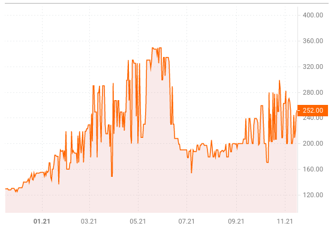

---

## Aktuelles Marktgeschehen
<!-- footer: Spezielle Rechnerarchitekturen - GPUs -->

* Nachfrageüberhang 🡢 Teuerung

  - A: COVID, Naturkat., Wirtschaftspolitik USA
  - N: COVID, Cryptomining, Cloud

---

## Allgemeine Funktionsweise

* rechnender Computerbestandteil (Prozessor)
* Visual Computing: Generierung von 2D und 3D
* ergänzt CPU für hochparallelisierbare Workloads

---

### Grundlagen

* __E__ ingabe: Bild, Video, 2D, 3D
* __V__ erarbeitung: 
  Geometrie, Textur, Belichtung
* __A__ usgabe: Bildschirm
  z.B. Full HD mit 8-bit Farbe
  

---
### 3D-Echtzeit-Grafikpipeline

Die Verarbeitungsschritte, die eine GPU in Echtzeit durchführt, um von einer 3D-Szene zu einer möglichst realitätsgetreuen 2D-Bildschirmausgabe zu gelangen.

---

<!-- _header: "
Bild: Grundmodell einer 3D-Echtzeit-Grafikpipeline [B2]
" -->

---
<!-- _header: "
__Vertex Processing #1__\n
Bild: Perspektivische Transformation & Normalisierung einer 3D-Szene [B3]
"-->

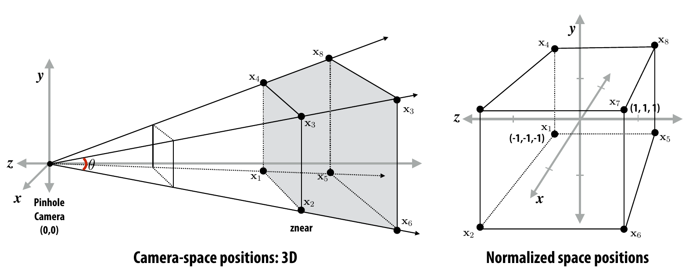

---
<!-- _header: "
__Vertex Processing #2__\n
Bild: Schematische Darstellung von Vertex Processing [B4]
"-->

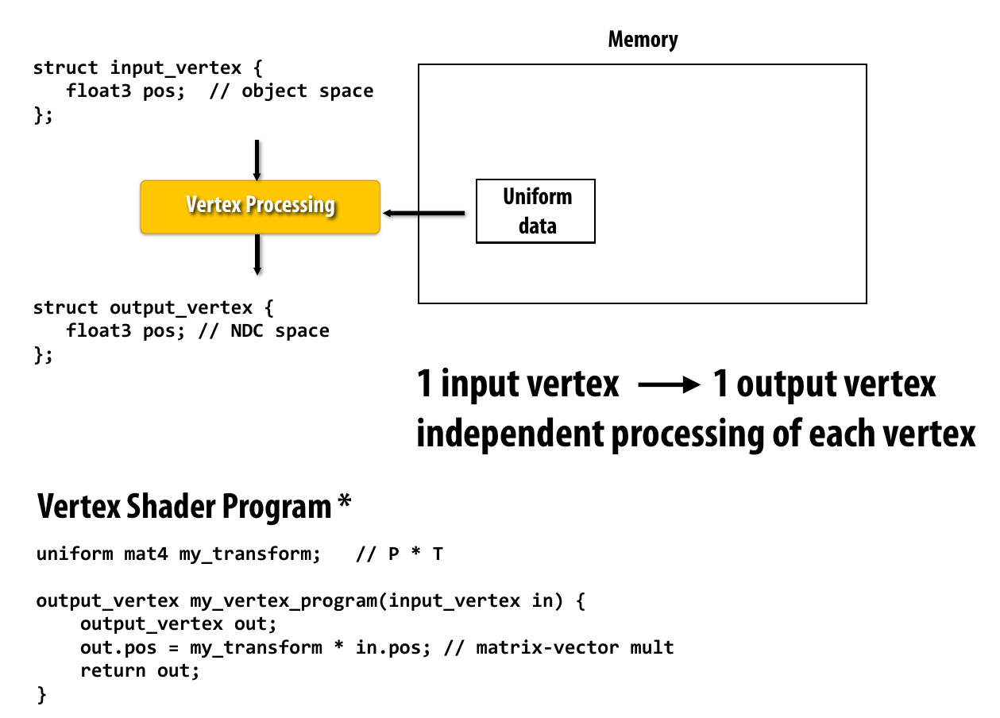

---

#### Instruktionen und Daten

SIMD: Single-Instruction-Multiple-Data

* SI: z.B. Matrix-Vektor-Multiplikation
* MD: Vertices, Fragments

---

## Geschichte

MDA ➢ CGA ➢ VGA ➢ GPU  

Text 🡢 2D 🡢 3D 🡢 GP
4K 🡢 24G

---

<!-- _header: "
Bild: IBM 5150 [B5]
" -->
#### [1981] MDA mit dem IBM Personal Computer

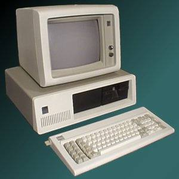

---
<!-- _header: "" -->
#### MDA mit dem IBM Personal Computer

* MDA: _Monochrome Display Adapter_
* angeschlossen via I/O-Slot
* monochrom, zeichenbasiert
* maximale Auflösung: 80Z x 25p

---
<!-- _header: "
MDA mit dem IBM Personal Computer\n
l.: Blockdiagramm der Systemplatine des IBM PC (Ausschnitt) [B6]\n
r.: Blockdiagramm des Monochrome Display Adapter im IBM PC [B7]
" -->

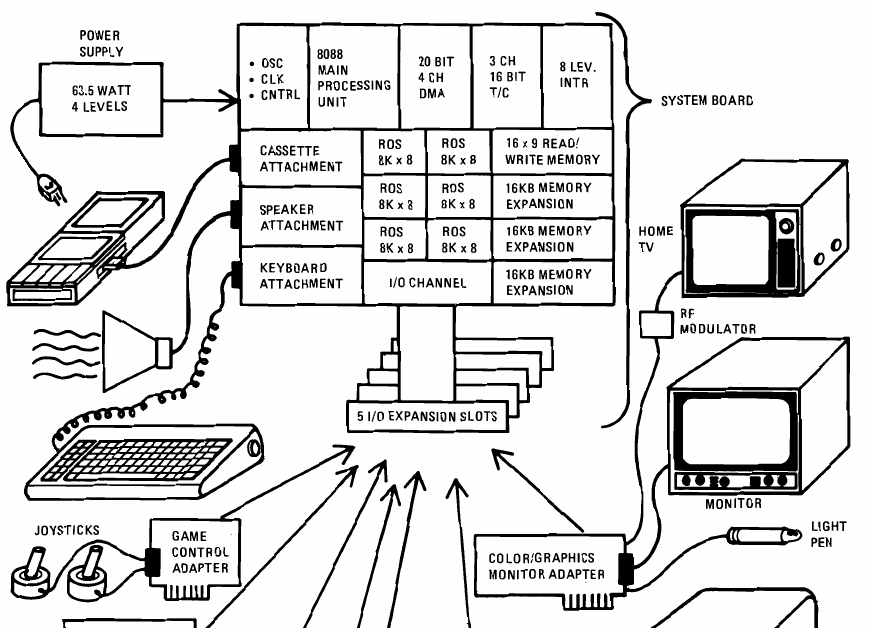 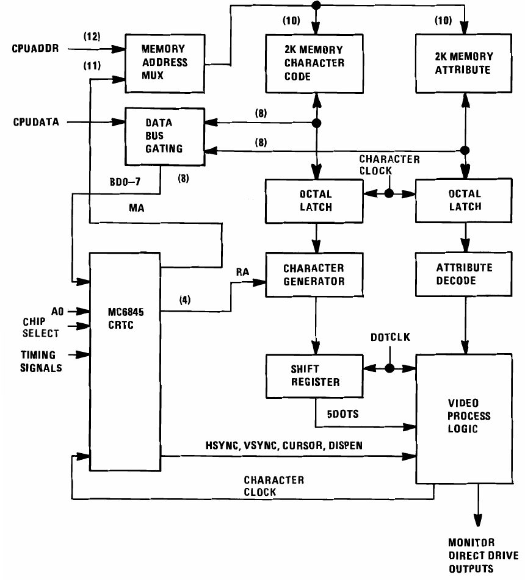

---

<!-- _header: "Bild: [B8]" -->
#### [1987] CGA mit IBM PS/2 25

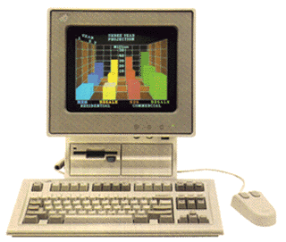

---
<!-- _header: "" -->
#### CGA mit IBM PS/2 25

* MCGA: _Multicolor Graphics Array_
* Teil der Systemplatine
* zeichenbasierte und pixelbasierte Betriebsmodi
* max. Auflösung: 640x480 mit 2 Farben
* max. gleichzeitige Farben: 256

---
<!-- _header: "
__CGA mit IBM PS/2 25__\n
l.: Blockdiagramm der Systemplatine des IBM PS/2 25 [B9]\n
r.: Blockdiagramm des Multicolor Graphics Array im IBM PS/2 25 [B10]
" -->

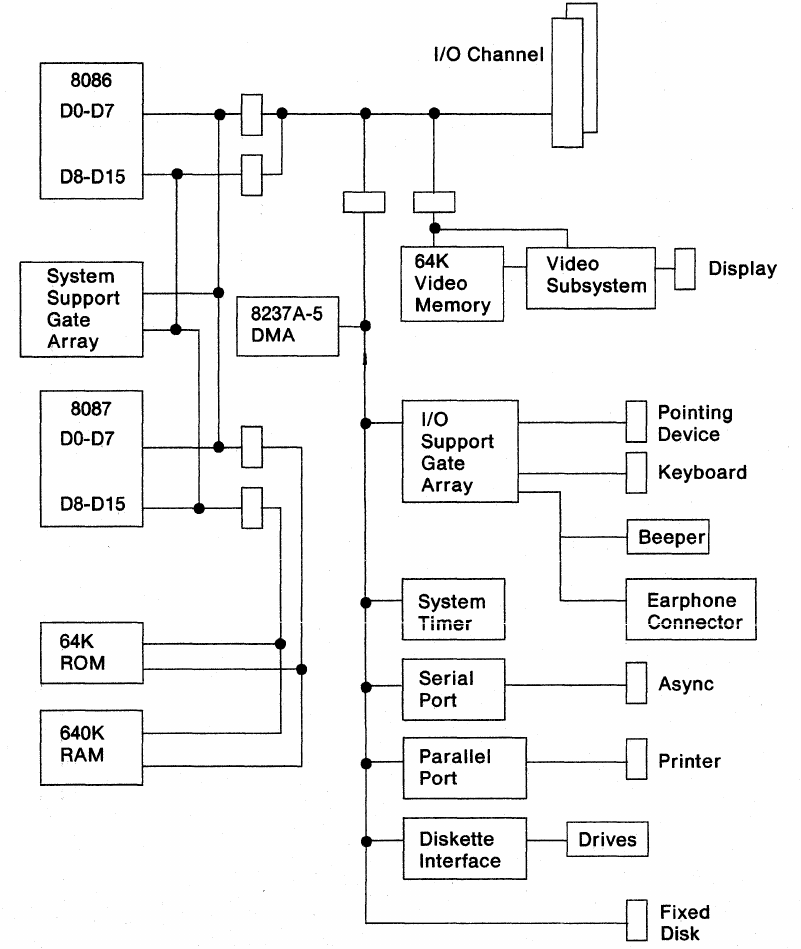 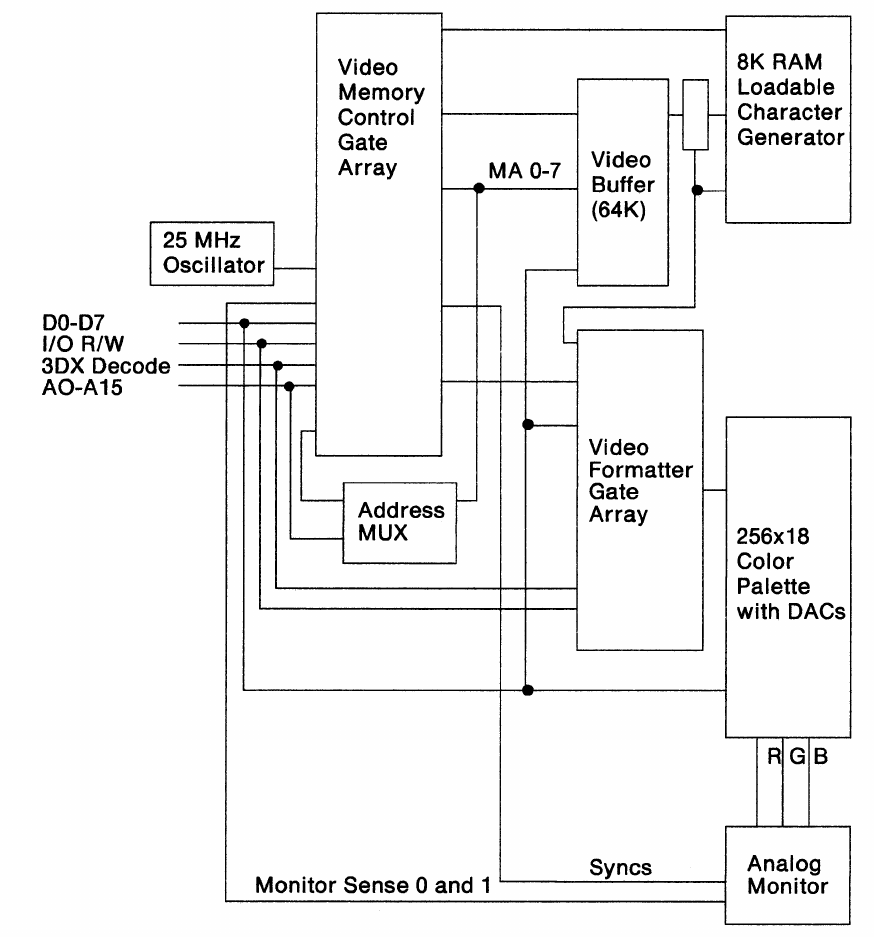

---
<!-- _header: "
Bild: [B11]
" -->
#### [1988] VGA mit IBM PS/2 50

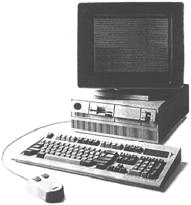

---
<!-- _header: "" -->
#### VGA mit IBM PS/2 50

* VGA: _Video Graphics Array_
* analoger Grafiktreiber mit mehr Farben
* zeichenbasierte und mehr pixelbasierte Betriebsmodi
* max. Auflösung: 640x480 mit 16 Farben
* _fernerhin: SuperVGA und Erweiterungen_

---

<!-- _header: "
__VGA mit IBM PS/2 50__\n
l.: Blockdiagramm der Systemplatine des IBM PS/2 50 [B12] \n
r.: Blockdiagramm der VGA-Funktion [B13]
" -->

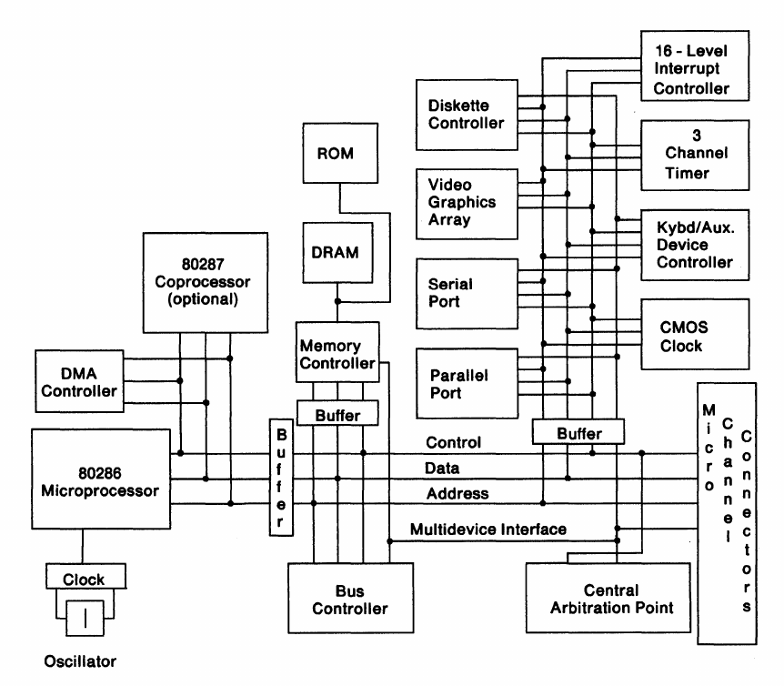 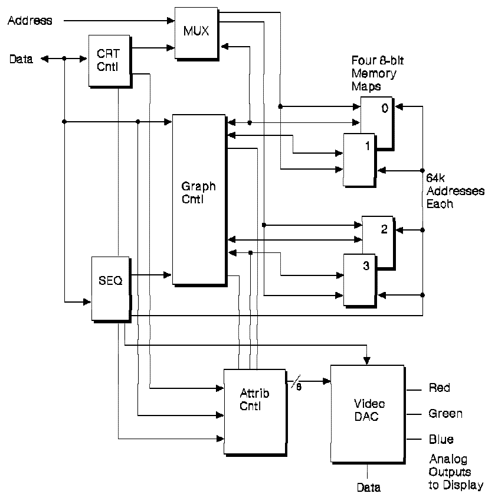

---
<!-- _header: "
Bild: 3dfx SST-1-Grafikkarte \"Diamond Monster\" [B14]
" -->
#### [1996] 3D mit 3dfx SST-1

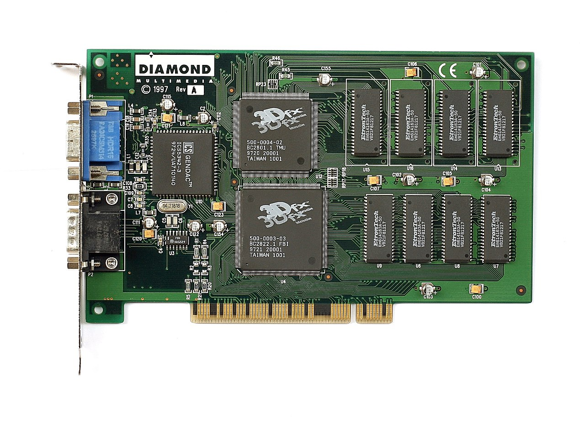

SST-1 Graphics Engine for 3D Game Acceleration:
_Voodoo Graphics_

---
<!-- _header: "
__3D mit 3dfx Voodoo Graphics__\n
Video: [B15]
" -->

<video src="res/quake.webm" autoplay autobuffer controls> </video>

---
<!-- _header: "
__3D mit 3dfx SST-1__\n
Bild: [B16]
" -->

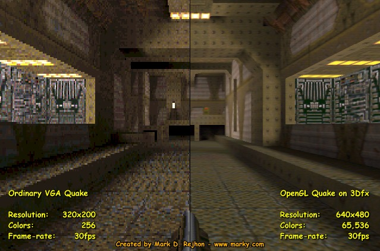

---
<!-- _header: "" -->
#### 3D mit 3dfx SST-1 

* 3D Graphics Accelerator (Standardprimitiv: △)
* angeschlossen über PCI
* max. Auflösung: 800x600 mit 16bit-Farbe

---
<!-- _header: "
__3D mit 3dfx SST-1__\n
l.: Blockdiagramm: SST-1 mit 3 ASICs [B17]\n
r.: Blockdiagramm: Renderingpipeline einer SST-1 mit 3 ASICs [B18]
"-->

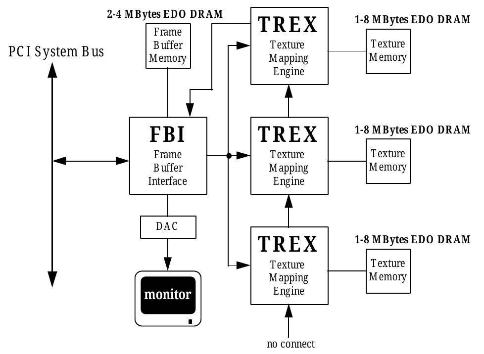 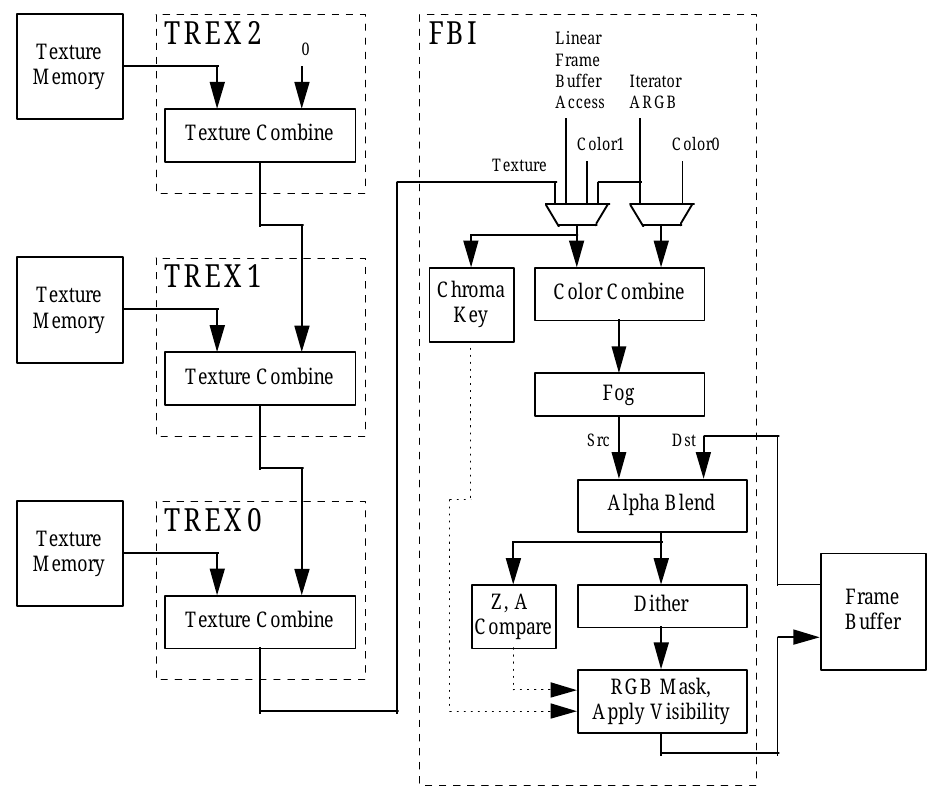

---
<!-- _header: "
Bild: Diamond Viper V330 4Mb @ RIVA 128 GPU [B19]
" -->
#### [1997] Endlich GPUs: Nvidia RIVA 128

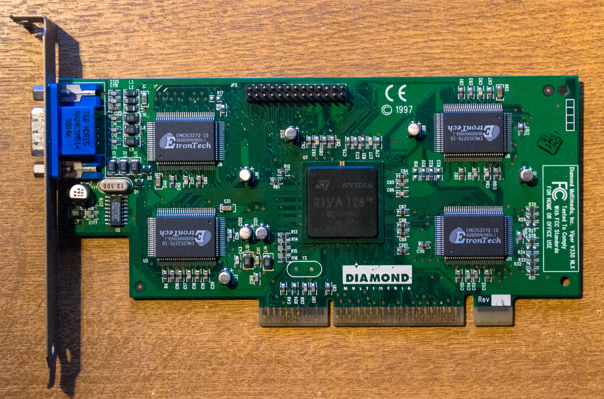

---
<!-- _header: ""-->
#### Endlich GPUs: Nvidia RIVA 128

* Grafikchip für 2D, Video und 3D (Standardprimitiv: △)
* angeschlossen über PCI oder AGP
* max. Auflösung: 800x600

---
<!-- _header: "
__Endlich GPUs: Nvidia RIVA 128__\n
l.: Blockdiagramm der RIVA-128-Architektur [B20]\n
r.: Darstellung des RIVA-128-Chips [B21]
" -->

 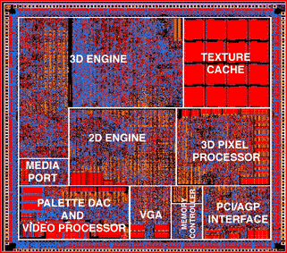

---
<!-- _header: "
Bild: Grafikkarte \"ATI Radeon 9700\" [B22]
" -->
#### [2002] ATI Radeon R300 und Direct3D 9

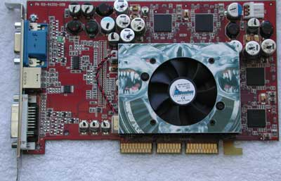

---
<!-- _header: "" -->
#### Radeon R300 und Direct3D 9

* GPU von ATI
* kompatibel mit Direct3D 9
* extreme Parallelisierung:
  - Transistorzahl: _107 Mio._
  - Speicherbandbreite: _256bit_
* angeschlossen via AGP 8x

---
<!-- _header: "
__ATI R300 und Direct3D 9__\n
Bild: Natural Light Demo mit der Radeon 9700 [B23]\n
" -->

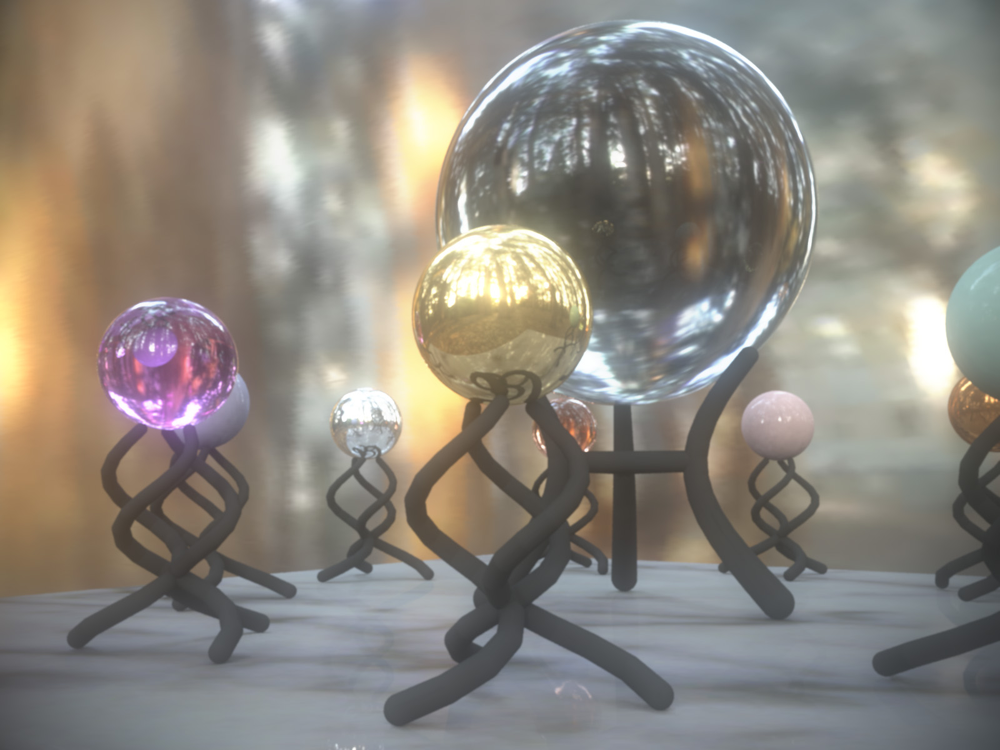

---
<!-- _header: "
__ATI R300 und Direct3D 9__\n
l.:  Grafikchip der ATI Radeon 9700 [B24]\n
r.: FPPU der Radeon 9700 [B25]
" -->
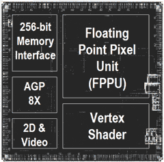 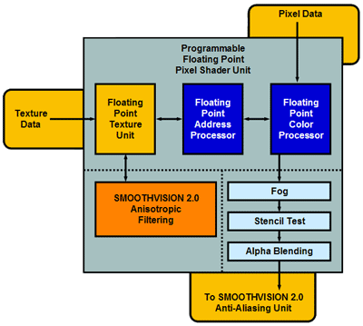

--- 

#### Direct3D 9

* Pixel Shader 2.x, Vertex Shader 2.x
  Control Flow, Delimitierung
* DirectX Effects: 
  Programmatische Kombinierung von Shadern
* Single-Precision-Floating-Point
  
---

<!-- _header: "
Bild: Direct3D 10 - Pipelineübersicht [B26]
"-->

#### Direct3D 10

* Neudesign der Grafikpipeline  
  -> Entlastung der CPU
* weitere Pipelinephasen
* höhe Programmierbarkeit der Pipeline

---

#### Direct3D - im Laufe der Zeit

Fixed-function Pipeline 🡢 programmierbare Shader

---
<!-- _header: "" -->
#### GPUs - im Laufe der Zeit

* Minimierung der Strukturgrößen
* höhere Taktraten von Prozessor und Speicher
* Vergrößerung des Grafikspeichers
* Unterstützung moderner Interfaces (neuerer PCI-Versionen)

---
<!-- _header: __GPUs - im Laufe der Zeit__ -->

* Ausweitung der API-Unterstützung  
  (Direct3D, OpenGL, OpenCL, Vulkan, CUDA)
* Hinzufügen von Grafikalgorithmen  
  (Antialiasing, Video-Kodierung, Shading etc.)
* Flexibilisierung der Grafikpipeline

---

## Geschichte

* Leistung
* Erschwinglichkeit
* Funktionalität
* Skalierbarkeit
* Programmierbarkeit
* Mobilität

---

## Geschichte

   
MDA ➢ CGA ➢ VGA ➢ GPU  
  
Text 🡢 2D 🡢 3D 🡢 GP
 
4K 🡢 24G

---

## Architektur
###### Am Beispiel von AMD RDNA 2

---
<!-- _header: "
Bild: Architekturüberblick von AMD RDNA 2 [B27]
"-->

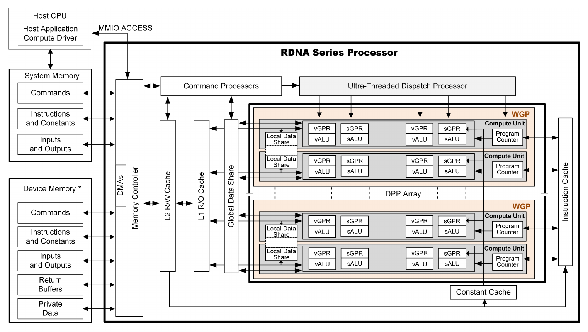

---

### Anweisungen in RDNA 2 - sALU
<!-- _header: "" -->

<table><tr>
<th> KATEGORIE </th>
<th> BEISPIEL </th>
<th> ERKLÄRUNG </th>
</tr><tr>
<th> Bedingungsanw. </th>
<td> S_CSELECT_B64 </td>
<td> <pre>D = SCC ? S0 : S1 </td>
</tr><tr>
<th> Ganzzahl-Arithmetik </th>
<td> S_ADD_U32 </td>
<td> <pre>D = S0 + S1, SCC = carry out </td>
</tr><tr>
<th> Vergleiche</th>
<td> S_CMP_EQ_U64 </td>
<td> <pre>SCC = S0 == S1 </td>
</tr><tr>
<th> Bitweise Anw.</th>
<td> S_AND_B64 </td>
<td> <pre>D = S0 & S1 </td>
</tr><tr>
<th> Zugriffsanw.</th>
<td> S_GETREG_B32 </td>
<td> Ein Hardwareregister in die LSBs von D laden </td>
</tr>
</table>

---

### Anweisungen in RDNA 2 - vALU
<!-- _header: "" -->

<table><tr>
<th> BEISPIEL </th>
<th> ERKLÄRUNG </th>
</tr><tr>
<td> V_DOT2C_F32_F16 </td>
<td> <pre>D.f32 =
S0.f16[0] * S1.f16[0] +
S0.f16[1] * S1.f16[1] + D.f32 </pre> </td>
</tr><tr>
<td> V_EXP_F32 </td>
<td> <pre>D.f = pow(2.0, S0.f) </td>
</tr><tr>
<td> V_LOG_F32 </td>
<td> <pre>D.f = log2(S0.f) </td>
</tr><tr>
<td> V_SQRT_F64 </td>
<td> <pre>D.d = sqrt(S0.d) </td>
</tr><tr>
<td> V_SIN_F16 </td>
<td> <pre>D.f16 = sin(S0.f16 * 2 * PI) </td>
</tr>
</table>

---

### CPU vs. GPU

<table><tr>
<th> Prozessor </th>
<th> Ryzen 9 5900X </th>
<th> Geforce RTX 3090 </th>
</tr><tr>
<th> Kernzahl </th>
<td> 12 </td>
<td> ~11500 </td>
</tr><tr>
<th> Kernfrequenz (MHz)</th>
<td> 3700 </td>
<td> 1395 </td>
</tr><tr>
<th> Chipfläche (mm)</th>
<td> 286 </td>
<td> 628 </td>
</tr><tr>
<th> Leistung (W)</th>
<td> 105 </td>
<td> 350 </td>
</tr><tr>
<th> Transistorzahl (Mio.)</th>
<td> 10,39 </td>
<td> 28,3 </td>
</tr>
<tr>
<th> Speicherbandbreite (GB/s)</th>
<td> 47,68 </td>
<td> 936 </td>
</tr>
<tr>
<th> BLAS - dGEMM-NN (GFLOPS)</th>
<td> 54 </td>
<td> 602 </td>
</tr>
</table>

---

### Einsatzbereiche

 
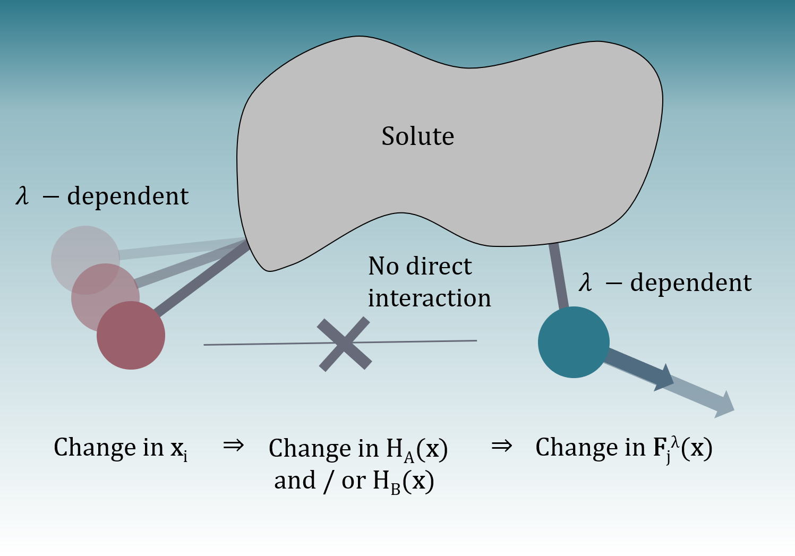
 
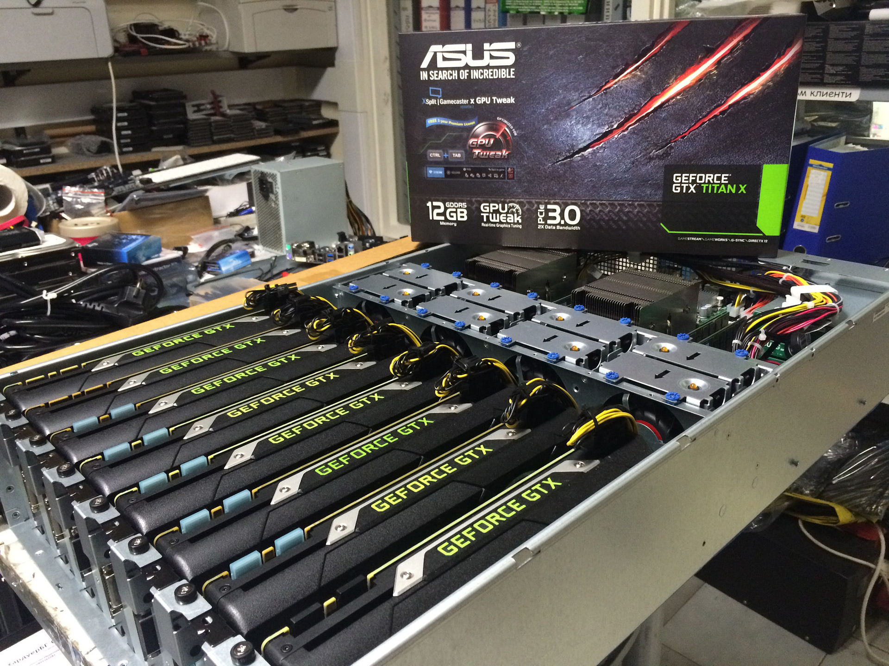

---

### Echtzeitgrafik

* Multimedia
* Gaming
* 3D-Modellierung

---

### General-Purpose Computing

* Mathe, Physik etc.
* Audio-/Videokodierung
* Maschinelles Lernen

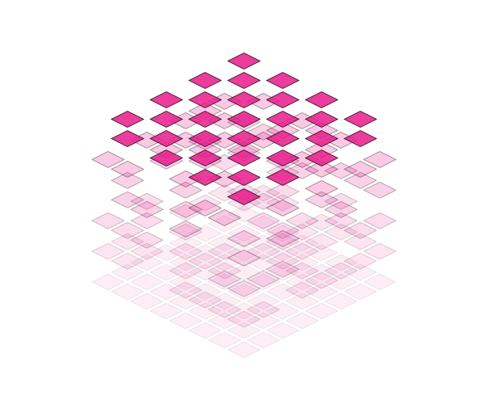

---

### High-Performance Computing

* Cryptomining
* Super Computer
* [Folding@Home](https://foldingathome.org)

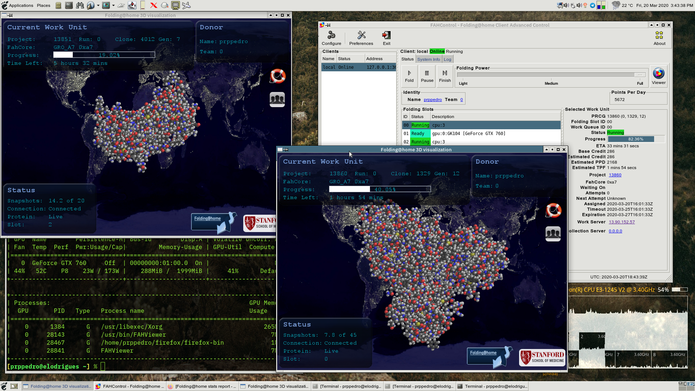

---

## Ausblick: Photorealismus mit Raytracing

---
<!-- _header: "" -->

<video src="res/raytracing.webm" autoplay autobuffer controls height=400> </video>

---
<!-- _header: "
__Photorealismus mit Raytracing__\n
l.: Ray-Tracing-Verfahren [B28]\n
r.: Ray Tracing mit NVIDIA Turing und RT Cores [B29]
"-->

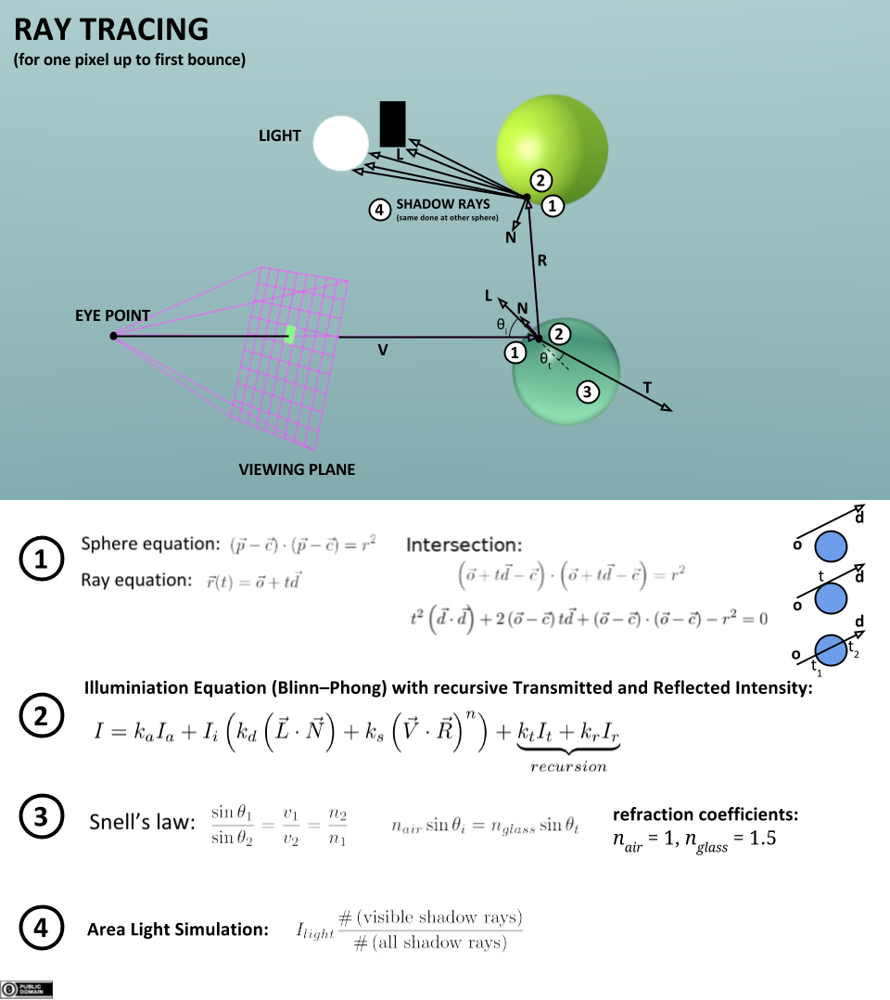 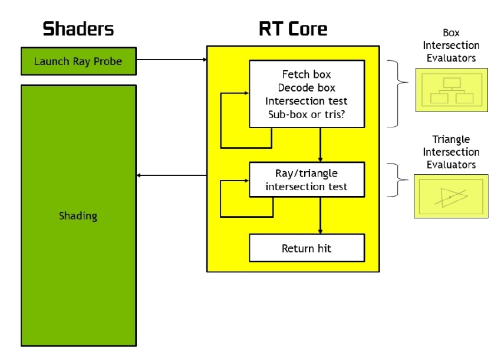

---

Vielen Dank für Ihre Zeit!

---
<!-- _header: "" -->
### Quellen

[1]3dfx Interactive, Inc.: SST-1(a.k.a. Voodoo Graphics™) (1999)
[2]3DFX Retro Freak: Quake 1 on 3DFX: Voodoo 1 (640x480). 4:09, 2017
[3] A long look at AMD’s Zen 3 core and chips. URL https://semiaccurate.com/2020/11/07/a-long-look-at-amds-zen-3-core-and-chips/. - abgerufen am 2021-11-15. — SemiAccurate
[4]AMD: „RDNA 2“ Instruction Set Architecture - Reference Guide (2020)
[5] AMD Ryzen 9 5900X Benchmarks - OpenBenchmarking.org. URL https://openbenchmarking.org/vs/Processor/AMD+Ryzen+9+5900X+12-Core. - abgerufen am 2021-11-13
[6] AMD Ryzen 9 5900X Specs. URL https://gadgetversus.com/processor/amd-ryzen-9-5900x-specs/. - abgerufen am 2021-11-15. — GadgetVersus
[7] Beyond3D - ATI R300 & NVIDIA NV30 - A Technical Comparison. URL https://www.beyond3d.com/content/articles/74/. - abgerufen am 2021-11-12
[8] Deshalb bleiben Halbleiter knapp: Chip-Nachfrage übersteigt Angebot um 30 Prozent - Server & Clients. URL https://www.ict-channel.com/server-clients/chip-nachfrage-uebersteigt-angebot-um-30-prozent.124451.html. - abgerufen am 2021-11-01. — ICT CHANNEL
[9]Hennessy, John L ; Patterson, David A: Computer architecture: a quantitative approach, 2019 — ISBN 978-0-12-811906-8
[10]Hinum, Klaus: AMD Ryzen 9 5900X Processor - Benchmarks and Specs. URL https://www.notebookcheck.net/AMD-Ryzen-9-5900X-Processor-Benchmarks-and-Specs.508439.0.html. - abgerufen am 2021-11-15. — Notebookcheck

---
<!-- _header: __Quellen__ -->

[11]Hinum, Klaus: NVIDIA GeForce RTX 3090 GPU - Benchmarks and Specs. URL https://www.notebookcheck.net/NVIDIA-GeForce-RTX-3090-GPU-Benchmarks-and-Specs.495276.0.html. - abgerufen am 2021-11-15. — Notebookcheck
[12]International Business Machines Corporation: Video Subsystem Technical Reference Manual - VGA Function, 1992
[13]Kayvon Fatahalian: Real-Time 3D Graphics Pipeline Architecture
[14] Leela Chess Zero. URL https://lczero.org/. - abgerufen am 2021-11-15
[15] List of Nvidia graphics processing units. Wikipedia.
[16]Mark D. Rejhon: Split Screenshot of VGA Quake versus 3Dfx OpenGL Quake. URL https://www.marky.ca/3d/quake/compare/. - abgerufen am 2021-11-08
[17] Mining-Farmen, Corona, Trump - der Mangel hat viele Ursachen - Halbleiterkrise: Chip-Knappheit ohne Ende - Golem.de. URL https://www.golem.de/news/halbleiterkrise-chip-knappheit-ohne-ende-2105-156561.html. - abgerufen am 2021-11-01
[18] MSI GeForce GTX 1050 Ti ab 252,00 € (Black Friday Deals) | Preisvergleich bei idealo.de. URL https://www.idealo.de/preisvergleich/OffersOfProduct/5157201_-geforce-gtx-1050-ti-msi.html#pricedevelopment. - abgerufen am 2021-11-16
[19] NVIDIA GeForce RTX 3090 Benchmarks - OpenBenchmarking.org. URL https://openbenchmarking.org/vs/Graphics/NVIDIA+GeForce+RTX+3090. - abgerufen am 2021-11-13
[20] Nvidia GeForce RTX 3090 Specs. URL https://gadgetversus.com/graphics-card/nvidia-geforce-rtx-3090-specs/. - abgerufen am 2021-11-15. — GadgetVersus
[21]Patterson, David A ; Hennessy, John L: Computer organization and design: the hardware/software interface, 2021 — ISBN 978-0-12-820109-1
[22] Rendering with Natural Light. URL http://www.pauldebevec.com/RNL/. - abgerufen am 2021-11-12
[23] RIVA 128 Brochure. URL https://web.archive.org/web/19970706014309/http://www.nvidia.com/product/riva128/index.html. - abgerufen am 2021-11-08

---
<!-- _header: __Quellen__ -->

[24]Sanchez, Julio ; Canton, Maria P.: The PC Graphics handbook. Boca Raton, FL : CRC Press, 2003 — ISBN 978-0-8493-1678-4
[25]Shimpi, Anand Lal: ATI’s Radeon 9700 (R300) – Crowning the New King. URL https://www.anandtech.com/show/947. - abgerufen am 2021-11-12
[26] The Amber Molecular Dynamics Package. URL http://ambermd.org/index.php. - abgerufen am 2021-11-15
[27]Walton, Jarred: The GPU Price Index, October 2021. URL https://www.tomshardware.com/news/gpu-pricing-index. - abgerufen am 2021-11-01. — Tom’s Hardware

---
<!-- _header: "" -->

### Bildquellen

[B1] https://www.idealo.de/preisvergleich/OffersOfProduct/5157201_-geforce-gtx-1050-ti-msi.html#pricedevelopment  
[B2] Kayvon Fatahalian: Real-Time 3D Graphics Pipeline Architecture, S. 12
[B3] Kayvon Fatahalian: Real-Time 3D Graphics Pipeline Architecture, S. 20
[B4] Kayvon Fatahalian: Real-Time 3D Graphics Pipeline Architecture, S. 22
[B5] https://homecomputermuseum.de/fileadmin/user_upload/Computer/klein/97.jpg
[B6] International Business Machines Corporation: Personal Computer Technical Reference Manual, 1981, S. 19
[B7] International Business Machines Corporation: Personal Computer Technical Reference Manual, 1981, S. 57
[B8] https://www.ardent-tool.com/qtechinfo/img/8525.gif
[B9] International Business Machines Corporation: IBM Personal System/2 Model 25 Technical Reference (1987), S. 17
[B10] International Business Machines Corporation: IBM Personal System/2 Model 25 Technical Reference (1987), S. 50
[B11] https://www.ardent-tool.com/qtechinfo/img/8550.gif

---
<!-- _header: __Bildquellen__ -->

[B12] International Business Machines Corporation: IBM Personal System/2 Model 50 Technical Reference (1988), S. 13
[B13] International Business Machines Corporation: Video Subsystem Technical Reference Manual - VGA Function, 1992, S. 6
[B14] https://de.wikipedia.org/wiki/3dfx_Voodoo_Graphics#/media/Datei:KL_Diamond_Monster3D_Voodoo_1.jpg
[B15] https://www.youtube.com/watch?v=P8qlE5XBopw
[B16] https://www.marky.ca/3d/quake/quake-split.jpg
[B17] 3dfx Interactive, Inc.: SST-1(a.k.a. Voodoo Graphics™) (1999), S. 9
[B18] 3dfx Interactive, Inc.: SST-1(a.k.a. Voodoo Graphics™) (1999), S. 12
[B19] https://en.wikipedia.org/wiki/RIVA_128#/media/File:Diamond_Viper_V330_AGP_@_nVIDIA_RIVA_128.jpg
[B20] https://web.archive.org/web/19970706014255im_/http://www.nvidia.com/product/riva128/images/architecture.gif
[B21] https://web.archive.org/web/19970706014309im_/http://www.nvidia.com/product/riva128/images/P4_DIE.gif
[B22] https://images.anandtech.com/reviews/video/ati/R300/card_sm.jpg
[B23] http://www.pauldebevec.com/RNL/RNL_frame0720.jpg
[B24] https://images.anandtech.com/reviews/video/ati/R300/r300die.gif
[B25] https://images.anandtech.com/reviews/video/ati/R300/fppu.gif
[B26] https://docs.microsoft.com/en-us/windows/win32/direct3d10/images/d3d10-pipeline-stages.png
[B27] AMD: „RDNA 2“ Instruction Set Architecture - Reference Guide (2020), S. 4
[B28] https://upload.wikimedia.org/wikipedia/commons/9/95/Ray_Tracing_Illustration_First_Bounce.png
[B29] NVIDIA: NVIDIA Turing GPU Architecture, Fig. 20
