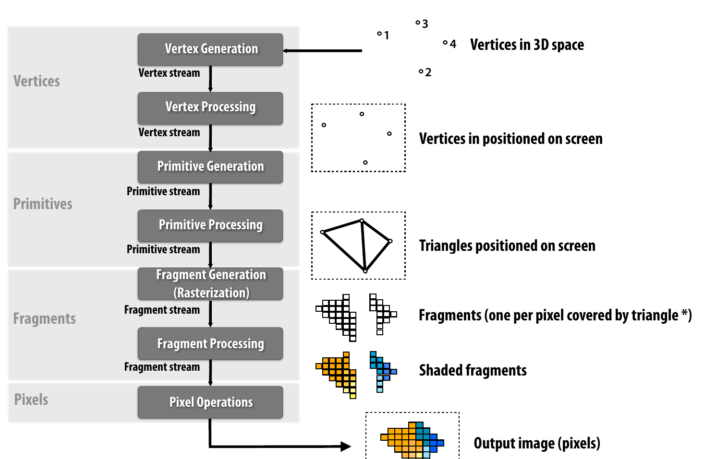
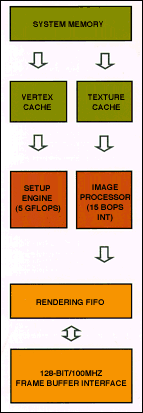

# Graphics Processing Units

###### Spezielle Rechnerarchitekturen - WS' 21/22

---

## Aktuelles Marktgeschehen
<!-- footer: Spezielle Rechnerarchitekturen - GPUs -->

* Nachfrageüberhang 🡢 Teuerung

  - A: COVID, Naturkat., Wirtschaftspolitik USA
  - N: COVID, Cryptomining, Cloud

---

## Allgemeine Funktionsweise

* rechnender Computerbestandteil (Prozessor)
* Visual Computing: Generierung von 2D und 3D
* ergänzt CPU für hochparallelisierbare Workloads

---

### Grundlagen

* Eingabe: Bild, Video, 2D, 3D
* Verarbeitung: 
  Geometrie, Textur, Belichtung
* Ausgabe: Bildschirm
  z.B. Full HD mit 8-bit Farbe
  

---
### 3D-Echtzeit-Grafikpipeline

Die Verarbeitungsschritte, die eine GPU in Echtzeit durchführt, um von einer 3D-Szene zu einer möglichst realitätsgetreuen 2D-Bildschirmausgabe zu gelangen.

---

<!-- _header: "
__Grafikpipeline__
" -->

---

#### Vertex Processing #1

---

#### Vertex Processing #2

---

#### Instruktionen und Daten

SIMD: Single-Instruction-Multiple-Data

* SI: z.B. Matrix-Vektor-Multiplikation
* MD: Vertices, Fragments

---

## Geschichte

   
MDA ➢ CGA ➢ VGA ➢ GPU  
  
Text 🡢 2D 🡢 3D 🡢 GP
 
4K 🡢 24G

---

<!-- _header: "" -->
#### [1981] MDA mit dem IBM Personal Computer

---
<!-- _header: "" -->
#### MDA mit dem IBM Personal Computer

* MDA: _Monochrome Display Adapter_
* angeschlossen via I/O-Slot
* monochrom, zeichenbasiert
* maximale Auflösung: 80Z x 25p

---
<!-- _header: "
MDA mit dem IBM Personal Computer\n
l.: Blockdiagramm der Systemplatine des IBM PC (Ausschnitt)\n
r.: Blockdiagramm des Monochrome Display Adapter im IBM PC
" -->

 

---

<!-- _header: "" -->
#### [1987] CGA mit IBM PS/2 25

---
<!-- _header: "" -->
#### CGA mit IBM PS/2 25

* MCGA: _Multicolor Graphics Array_
* Teil der Systemplatine
* zeichenbasierte und pixelbasierte Betriebsmodi
* max. Auflösung: 640x480 mit 2 Farben
* max. gleichzeitige Farben: 256

---
<!-- _header: "
__CGA mit IBM PS/2 25__\n
l.: Blockdiagramm der Systemplatine des IBM PS/2 25\n
r.: Blockdiagramm des Multicolor Graphics Array im IBM PS/2 25
" -->

 

---
<!-- _header: "" -->
#### [1988] VGA mit IBM PS/2 50

---
<!-- _header: "" -->
#### VGA mit IBM PS/2 50

* VGA: _Video Graphics Array_
* analoger Grafiktreiber mit mehr Farben
* zeichenbasierte und mehr pixelbasierte Betriebsmodi
* max. Auflösung: 640x480 mit 16 Farben
* _fernerhin: SuperVGA und Erweiterungen_
<!-- TODO: vielleicht SuperVGA, XGA etc. auslagern auf Extrafolie(n) -->
<!-- Vielleicht lieber nicht. -->

---

<!-- _header: "
__VGA mit IBM PS/2 50__\n
l.: Blockdiagramm der Systemplatine des IBM PS/2 50\n
r.: Blockdiagramm der VGA-Funktion
" -->

 

---
<!-- _header: "" -->
#### [1996] 3D mit 3dfx SST-1

SST-1 Graphics Engine for 3D Game Acceleration:
_Voodoo Graphics_

---
<!-- _header: "
__3D mit 3dfx Voodoo Graphics__\n
Videoquelle: https://www.youtube.com/watch?v=P8qlE5XBopw
" -->

<video src="res/quake.webm" autoplay autobuffer controls> </video>

---
<!-- _header: "
__3D mit 3dfx SST-1__\n
Bildquelle: https://www.marky.ca/3d/quake/quake-split.jpg
" -->

---
<!-- _header: "" -->
#### 3D mit 3dfx SST-1 

* 3D Graphics Accelerator (Standardprimitiv: △)
* angeschlossen über PCI
* max. Auflösung: 800x600 mit 16bit-Farbe

---
<!-- _header: "
__3D mit 3dfx SST-1__\n
l.: Blockdiagramm: SST-1 mit 3 ASICs\n
r.: Blockdiagramm: Renderingpipeline einer SST-1 mit 3 ASICs
"-->

 

---
<!-- _header: "Bild: Diamond Viper V330 4Mb @ RIVA 128 GPU" -->
#### [1997] Endlich GPUs: Nvidia RIVA 128

---
<!-- _header: ""-->
#### Endlich GPUs: Nvidia RIVA 128

* Grafikchip für 2D, Video und 3D (Standardprimitiv: △)
* angeschlossen über PCI oder AGP
* max. Auflösung: 800x600

---
<!-- _header: "
__Endlich GPUs: Nvidia RIVA 128__\n
l.: Blockdiagramm der RIVA-128-Architektur\n
r.: Darstellung des RIVA-128-Chips
" -->

 

---
<!-- _header: "" -->
#### [2002] ATI Radeon R300 und Direct3D 9

---
<!-- _header: "" -->
#### Radeon R300 und Direct3D 9

* GPU von ATI
* kompatibel mit Direct3D 9
* extreme Parallelisierung:
  - Transistorzahl: _107 Mio._
  - Speicherbandbreite: _256bit_
* angeschlossen via AGP 8x

---
<!-- _header: "
__ATI R300 und Direct3D 9__\n
Bild: Natural Light Demo mit der Radeon 9700\n
http://www.pauldebevec.com/RNL/RNL_frame0720.jpg
" -->

---
<!-- _header: "
__ATI R300 und Direct3D 9__\n
l.:  Grafikchip der ATI Radeon 9700\n
r.: FPPU der Radeon 9700
" -->
 

--- 

#### Direct3D 9

* Pixel Shader 2.x, Vertex Shader 2.x
  Control Flow, Delimitierung
* DirectX Effects: 
  Programmatische Kombinierung von Shadern
* Single-Precision-Floating-Point
  
---

#### Direct3D 10

* Neudesign der Grafikpipeline  
  -> Entlastung der CPU
* weitere Pipelinephasen
* höhe Programmierbarkeit der Pipeline

---

#### Direct3D - im Laufe der Zeit

Fixed-function Pipeline 🡢 programmierbare Shader

---
<!-- _header: "" -->
#### GPUs - im Laufe der Zeit

* Minimierung der Strukturgrößen
* höhere Taktraten von Prozessor und Speicher
* Vergrößerung des Grafikspeichers
* Unterstützung moderner Interfaces (neuerer PCI-Versionen)

---
<!-- _header: ""-->

* Ausweitung der API-Unterstützung  
  (Direct3D, OpenGL, OpenCL, Vulkan, CUDA)
* Hinzufügen von Grafikalgorithmen  
  (Antialiasing, Video-Kodierung, Shading etc.)
* Flexibilisierung der Grafikpipeline

---

## Geschichte

   
MDA ➢ CGA ➢ VGA ➢ GPU  
  
Text 🡢 2D 🡢 3D 🡢 GP
 
4K 🡢 24G

---

## Geschichte

* Leistung
* Erschwinglichkeit
* Funktionalität
* Skalierbarkeit
* Programmierbarkeit
* Mobilität

---

## Architektur

---

### CPU vs. GPU

<table><tr>
<th> Prozessor </th>
<th> Ryzen 9 5900X </th>
<th> Geforce RTX 3090 </th>
</tr><tr>
<th> Kernzahl </th>
<td> 12 </td>
<td> ~11500 </td>
</tr><tr>
<th> Kernfrequenz (MHz)</th>
<td> 3700 </td>
<td> 1395 </td>
</tr><tr>
<th> Chipfläche (mm)</th>
<td> 286 </td>
<td> 628 </td>
</tr><tr>
<th> Leistung (W)</th>
<td> 105 </td>
<td> 350 </td>
</tr><tr>
<th> Transistorzahl (Mio.)</th>
<td> 10,39 </td>
<td> 28,3 </td>
</tr>
<tr>
<th> Speicherbandbreite (GB/s)</th>
<td> 47,68 </td>
<td> 936 </td>
</tr>
<tr>
<th> BLAS - dGEMM-NN (GFLOPS)</th>
<td> 54 </td>
<td> 602 </td>
</tr>
</table>

---

### Einsatzbereiche

 

 

---

### Echtzeitgrafik

* Multimedia
* Gaming
* 3D-Modellierung

---

### General-Purpose Computing

* Mathe, Physik etc.
* Audio-/Videokodierung
* Maschinelles Lernen

---

### High-Performance Computing

* Cryptomining
* Super Computer
* [Folding@Home](https://foldingathome.org)

---

## Ausblick: Photorealismus mit Raytracing

---

### Quellen

[1] Deshalb bleiben Halbleiter knapp: Chip-Nachfrage übersteigt Angebot um 30 Prozent - Server & Clients. URL https://www.ict-channel.com/server-clients/chip-nachfrage-uebersteigt-angebot-um-30-prozent.124451.html. - abgerufen am 2021-11-01. — ICT CHANNEL
[2]Hennessy, John L ; Patterson, David A: Computer architecture: a quantitative approach, 2019 — ISBN 978-0-12-811906-8
[3] Mining-Farmen, Corona, Trump - der Mangel hat viele Ursachen - Halbleiterkrise: Chip-Knappheit ohne Ende - Golem.de. URL https://www.golem.de/news/halbleiterkrise-chip-knappheit-ohne-ende-2105-156561.html. - abgerufen am 2021-11-01
[4]Patterson, David A ; Hennessy, John L: Computer organization and design: the hardware/software interface, 2021 — ISBN 978-0-12-820109-1
[5]Walton, Jarred: The GPU Price Index, October 2021. URL https://www.tomshardware.com/news/gpu-pricing-index. - abgerufen am 2021-11-01. — Tom’s Hardware